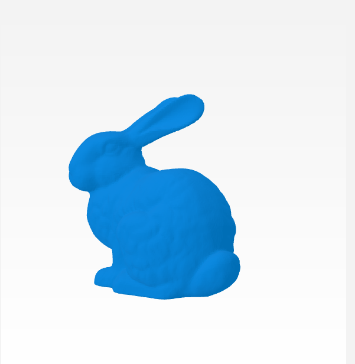
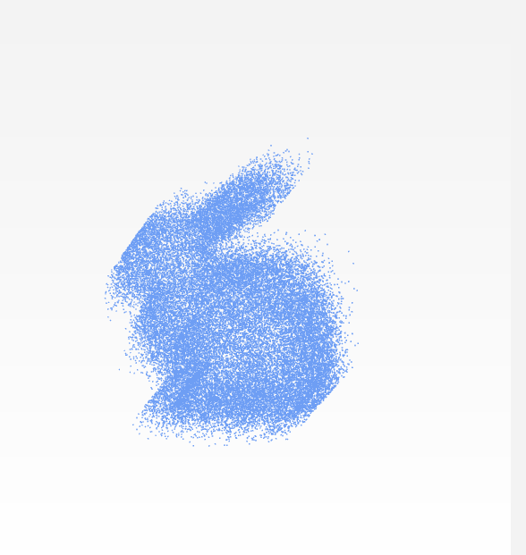
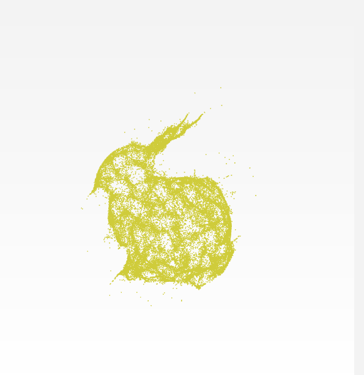

# guided_filter_point_cloud_denoising

C++ Implementation of PointCloud Denoising with Guided Filter originally defined in http://kaiminghe.com/publications/pami12guidedfilter.pdf 

Requires  PCL and Eigen libabries. 

## Algorithm definition; 


## Results; 
### Original Stanford Bunny;


### Noise Added to Original Cloud;


### Noise Added to Original Cloud;


## Installation and Usage
```cpp
git clone https://github.com/jediofgeverguided_filter_point_cloud_denoising.git
cd guided_filter_point_cloud_denoising
mkdir build && cd build
cmake .. 
make
```
After successfull build try the following command to reproduce results;

```cpp
./smooth_pcl ../data/bunny_original.pcd ../data/bunny_noisy.pcd ../data/bunny_smoothed.pcd
```

## Referencees
* https://github.com/aipiano/guided-filter-point-cloud-denoise 
* http://kaiminghe.com/publications/pami12guidedfilter.pdf 
